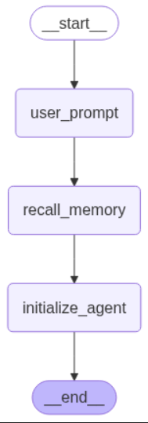

# 🧠 MEMORY_AGENT - LLM con Memoria en LangGraph

Este es un PoC (proof of concept) que explora cómo los LLMs pueden manejar memoria de forma efectiva utilizando LangGraph y agentes personalizados.

## 🚀 Descripción

El objetivo fue construir un agente conversacional con capacidad de memoria que:

- Pueda recordar información del usuario a lo largo de múltiples turnos.
- Utilice `LangGraph` como framework para el flujo conversacional.
- Exponga endpoints para interactuar con el agente vía API REST (FastAPI).

## 🧱 Estructura del Proyecto

📦 src/
├── 📁 api/         → Lógica de la API (configuración, dependencias)
│
├── 📁 routes/      → Endpoints de la app
│   ├── llm.py      → Interacción con el modelo LLM
│   └── users.py    → Gestión de usuarios
│
├── 📁 core/        → Núcleo del agente
│   ├── agent.py    → Agente principal con memoria
│   ├── graph.py    → Grafo conversacional con LangGraph
│   └── graph.ipynb → Notebook de experimentación
│
├── 📁 models/      → Definición de modelos de datos
│   └── user.py     → Modelo de usuario y memoria asociada
│
├── 📁 resources/          → Rescursos del sistema
│   ├── images/      
│       └── flow_agent.png  → Flujo del grafo con el agente
│
├── 📁 tools/       → Utilidades y ejecución
│   └── main.py     → Punto de entrada del proyecto
│
└── main.py         → Alias o acceso directo al launcher


## 🧱 Estructura conceptual

Usuario → API (FastAPI) → Ruta /llm → Agent (con memoria) → LangGraph (flujo conversacional) → Modelo LLM
                                      ↑
                                  Modelos / Users


## 📒 Notebooks

Incluye un notebook (`graph.ipynb`) con experimentos explorando la construcción del grafo de memoria.


## 🔄 Flujo del agente




## 🧪 Cómo correr el proyecto

1. Clonar el repositorio:

```bash
git clone https://github.com/tu_usuario/memory_agent.git
cd memory_agent
```

## 🐍 Cómo crear ambiente virtual

2. Ambiente virtual:

```bash
python -m venv .venv
source .venv/bin/activate  # o .venv\Scripts\activate en Windows
```

## ⬇️ Instalar dependencias

3. Instalar dependencias:

```bash
pip install -r requirements.txt
```

## 🚀 Cómo ejecutarlo


4. Ejecutar aplicación:

```bash
# Esto es un ejemplo de cómo ejecutar el programa
python src/main.py
```